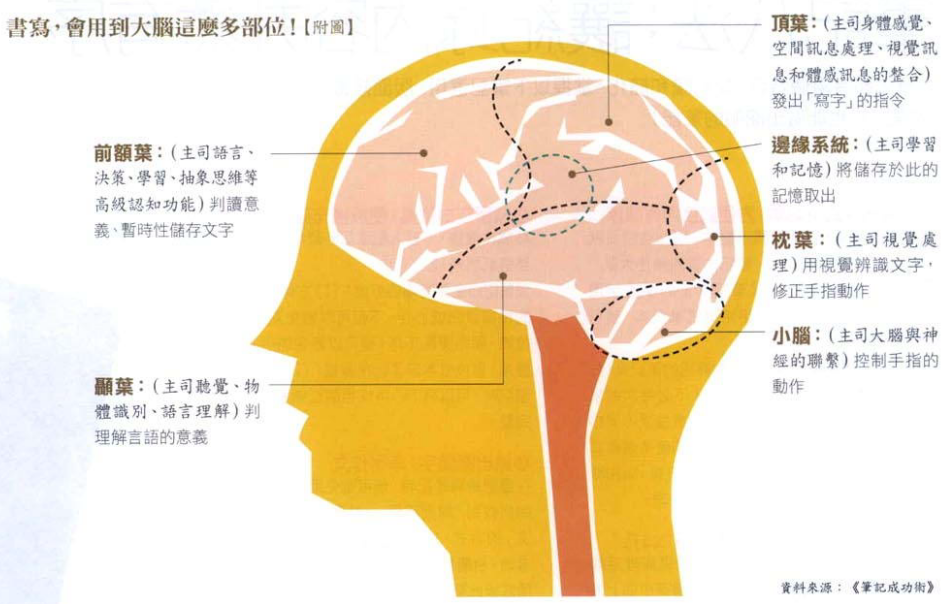

# 笔记八法:让记忆内容井然有序

1. 採用活页式笔记本:方便调换内页顺序;
2. 使用最普通的活页笔记本规格:26孔;
3. 明确的表头标记:X mark标记法;
4. 有效的版面配置:康乃尔笔记法;
5. 预留空白位置:便于补充注记;
6. 抓出关键字:串字作文;
7. 活用线条和图解:呈现事物顺序与关系;
8. 依序记录,宁可留空也别怕浪费纸.

# 书写活用大脑图

# 行事历九法：让工作排程一目了然

1. 工作排程第一步：确立目标；
2. 用倒推法拟定计划：从终点开始反推算；
3. 在显眼处写下【一年的目标】；
4. 年行事历：记下主要活动，把握全体样貌；
5. 使用记号与色笔，标记【重大事项】；
6. 切割版面，让工作规划更合理完善；
7. 醒目标示非预期、不确定事项；
8. 制订检核表，避免遗忘与拖延；
9. 使用便利贴，扩充版面内容。

# 理出讯息逻辑关系，把复杂变为简单

1. 抓取【数字】和【名词】，将长句子化为关键字组合；
2. 将资讯符号化，便于速记；
3. 附上【符号解说表】，熟记符号的意义；
4. 红线标记重点，快速理解笔记内容；
5. 善用线条与箭头，标示关系或阅读动线；
6. 练习简单图解，将复杂资讯化为图像；

# 为色彩赋予意义，让重点一目了然

1. 排列【色彩序阶】：标示重点；
2. 三色法：赋予颜色意义，协助资讯分类；
3. 选用3~5个颜色：避免色彩过多，混淆重点；
4. 红笔：抄写段落标题，做为笔记大纲；
5. 荧光笔/色铅笔：区分色块，进行可视化管理；
6. 各色便利贴：进行颜色管理；
7. 贴纸与印章：增添色彩与趣味；

# 修改不涂改，让资讯得以追踪

1. 以【删除线】修改记录：保留还原及追踪的可能；
2. 记录修改原因：不犯相同的错；
3. 醒目标示重点或大错：每次检阅笔记都能得到警惕。

# 定期检视，做笔记才有意义

# 详列待办清单，为突发状况做准备

# 详列待办清单，为突发状况做准备

1. 依照时间顺序，详列待办事项清单；
2. 详尽写出每件工作的内容；
3. 区分工作的性质；
4. 用红笔划掉已完成项目；
5. 制作【规格化的传话单】。

# 记录感动，从生活细节汲取创意

1. 以【今年热中的主题】做延伸联想；
2. 从【格言佳句】看见自身成长；
3. 用数位相机写【照片日志】；
4. 练习【生活绘本】