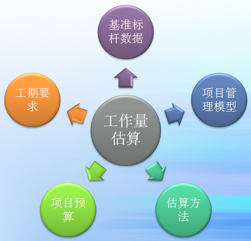

# 要素 --  基准标杆数据
* 基准标杆数据是以历史项目的数据为基础分析汇总出来的，通过收集项目数据，通过项目阶段、功能模块、人员角色等不同数据纬度来解剖分析其各个指标，建立不同类型项目的标杆数据。
* 标杆数据可以作为同类型项目的工作量估算参考基准，但同时标杆数据需要不断进行样本积累和学习，对参考值进行调整以满足变化的需要。
* 不同项目团队、同一项目团队的不同时期，因为团队成员综合能力的差异，标杆数据所体现出来的单位产出的成本和产能都会不同，没有统一的标准，因此需要针对实施本项目的团队确定工作效能基准数据。

# 要素 --  项目管理模型
* 选择合适的项目管理模型（项目过程）有利于项目过程、风险、成本的管理控制；
* 项目管理模型真实的再现了预设的项目执行过程，通过制定WBS分解任务项，定义了每个阶段、过程、任务所需要的工期、资源数量和人力成本；
* 常用的项目管理模型有：瀑布式、迭代式。
  * 在项目启动初期，需求清晰明确、变动少的，适合采取瀑布式的项目过程，有利于节省项目工作量；
  * 在项目启动初期，需求范围不全、目标不清晰，存在需求迭代变更的情况，适合采取迭代式的项目过程，有利于节省不必要的工作量损耗；

# 要素 --  项目估算方法
* 软件开发所涉及的因素（如开发语言、开发工具、开发流程、系统架构、开发人员的经验、业务复杂程度、项目特征等等）不仅多而且异常复杂，即便是极其类似的软件项目也不能完全照搬。因此估算前需要根据实际情况（如项目特征、估算时项目所处的阶段、是否有类似项目数据可参考，等）确定合适的估算方法。
* 常用的估算方法有：
* Delphi头脑风暴 （DWB）法
* 专家法
* 功能点分析(FPA)法
* 三点法

# 要素 --  项目预算
* 项目预算的额度决定了项目实现的需求范围、技术指标和实现的难易程度，间接影响了项目估算的结果；
* 任何项目的需求和成本估算都应该以项目的预算范围为基础，严重偏离预算的项目估算结果，将很可能重新进行项目估算的需要，甚至导致项目机会的丧失；

# 要素 --  项目工期要求
* 项目工期要求的紧急程度，会直接影响项目团队的人员规模、人员稳定性、团队效能、学习成本和沟通管理成本，这些风险因素应该在项目估算中得到体现，以项目风险系数的方式增加工作量；
* 项目风险系数根据经验判断在10%-100%之间进行取值，例如正常工期下估算为100人日的项目，在紧凑工期下的风险系数为30%，则评估工作量为130人日；